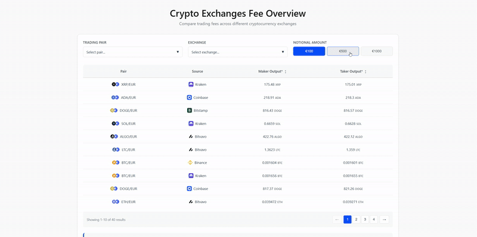

# Crypto Exchanges Purchase Outputs Comparison Tool [](https://fee-comparison.vercel.app/)

A simple React-Vite app that displays maker/taker outputs of various digital assets across different crypto exchanges. It’s built with TypeScript for type safety and Vite for fast development and optimized builds.


<p align="center">
  <a href="https://skillicons.dev">
    
  </a>
</p>

# Tech Stack
<p align="center">
  <a href="https://skillicons.dev">
    
  </a>
</p>

# Features
- Filter entries by pairs / exchanges
- Sort results in ascending / descending orders
- Pagination for large entries
- Mobile devices support


# Setup

1. Clone the repo
```
git clone https://github.com/7moodev/fee-comparison.git
cd fee-comparison
```
2. Install dependencies
```
npm install
```
3. Run locally
```
npm run dev
```
4. Build for production
```
npm run build
```
5. Preview the production build
```
npm run preview
```
